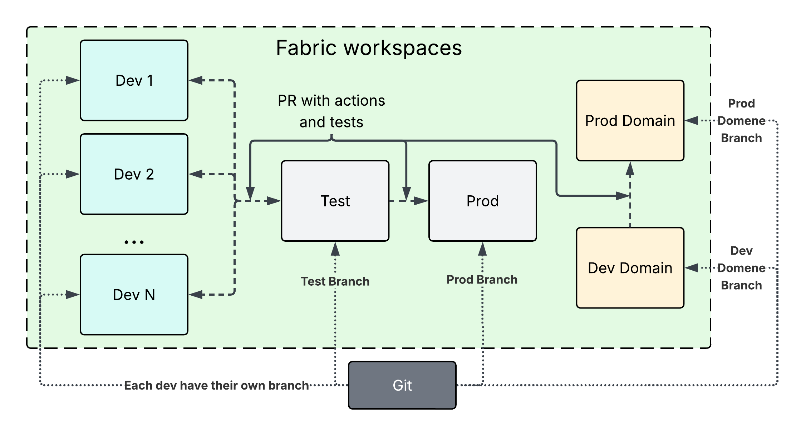

# Deployment & Git Integration
Setting up a robust deployment pipeline and version control strategy is critical to managing multiple developers in Microsoft Fabric without code collisions or pipeline breaks. It looks like this:



Each environment (Dev, Test, Prod) is its own Fabric workspace. The core Dev, Test, and Prod workspaces are strictly dedicated to data engineering and the ETL pipeline. All downstream reporting assets, semantic models, reports, and other analytical objects, live entirely within their respective business domain workspaces (see [Domain Workspaces](#domain-workspaces-self-service) below).

## Git Integration Strategy
Every Fabric workspace in our development lifecycle is integrated with a corresponding Git branch in our repository.

* **Repository Model:** To make it easier for PR to only include the relevant changes and for the domains to have more freedom for their own work, a **poly-repo** should be used. This will however make it more complex for handeling CI/CD workflows.
* **Branch Structure:** There are exactly two long-lived environment branches, `test` and `main` (Prod), each connected to its respective Fabric workspace. Every developer additionally works on their own short-lived **feature branch**, cut from `main` or the relevant branch, which is deleted once merged. Test and Prod never receive commits directly; they only change through a PR merge.

> [!NOTE]
> **Why bypass native Fabric Deployment Pipelines?**
> While Fabric offers native deployment pipelines, I don't use them because a workspace can only belong to a single native deveolpment pipeline. This creates a massive bottleneck for multi-developer workflows. Instead, we enforce a **Git-first, action-driven CI/CD workflow** (using GitHub Actions) for environment promotions.

## Environment Configuration
To ensure notebooks and semantic models connect to the correct Lakehouse, a centralized configuration file is maintained in the Git repository. This file stores all Lakehouse connection strings for every environment (Dev, Test, Prod).

How it works:
1. **Development**: Developers connect directly to the Lakehouses assigned to their private developer workspace.
2. **Isolation**: They develop, test, and commit changes inside their personal workspace, pushing code strictly to their individual feature branch.
3. **Automated Promotion**: During CI/CD deployment via Pull Request (PR) into test or main, the actions automatically updates the connection strings and other actions.

> [!WARNING]
> This file must **never** contain secrets (Service Principal client secrets, connection passwords, API keys). It holds only workspace/Lakehouse IDs. Credentials for the Service Principal used for [semantic model ownership](ownership.md) are managed separately through the CI/CD platform's secret store (GitHub Actions secrets) or Key Vault, never through this file.

#### Config File Example (`config.json`)
```json
{
  "environments": {
    "dev_dev1": {
      "workspace_id": "dev1-workspace-uuid",
      "lakehouse_id": "dev1-lakehouse-uuid"
    },
    "dev_dev2": {
      "workspace_id": "dev2-workspace-uuid",
      "lakehouse_id": "dev2-lakehouse-uuid"
    },
    "test": {
      "workspace_id": "test-workspace-uuid",
      "lakehouse_id": "test-lakehouse-uuid"
    },
    "prod": {
      "workspace_id": "prod-workspace-uuid",
      "lakehouse_id": "prod-lakehouse-uuid"
    }
  }
}
```

## Developer Workspaces
To prevent multiple developers from overwriting each other's work or corrupting active Fabric metadata, **each developer must have their own dedicated workspace** (e.g., `Dev 1`, `Dev 2`, ..., `Dev N`).

* **The Workflow:**
1. A developer creates a personal feature branch off of the `main` or relevant branch in GitHub.
2. They connect their private feature branch to their personal developer workspace.
3. They develop and commit changes inside their personal workspace.
4. Once development is complete, they submit a **Pull Request (PR)** to merge their feature branch into the `test` branch.

> [!NOTE]
> To maintain consistency without duplicating data, each developer workspace contains the standard four Lakehouses with the same schema. Additionally, they have custom schemas, where these custom schemas utilize shortcuts pointing directly to the production Lakehouse, using a prod_ prefix for clarity during development. Upon submitting a Pull Request (PR), a GitHub Action automatically scans and rewrites all code references, stripping the prod_ prefix so tables resolve to their standard names. This ensures seamless code execution across the governed Test and Prod data pipelines. Additionally, there is also an action that removes the shortcuts to lakhouse in the prod workspace. This method works as the metadata for the lakehouse is not included in the code sent to Git.

## Test & Production Workspaces
To prevent manual changes and maintain strict environment control, the **Test and Production workspaces** only assign Viewer and Admin (select few) roles, forcing all updates to run through the automated CI/CD pipeline. Merging a PR into the `test` branch automatically deploys the code and configures the correct connection strings using the `"test"` block in the centralized `config.json` file. Once stakeholders approve the changes, merging the PR from `test` into the `main` (Production) branch triggers the final automated deployment, which updates the configuration path to `"prod"`.

### Rollback Strategy
A CI/CD pipeline is not complete without a way back out of a bad deployment:
* **Code:** A bad `main` deployment is reverted via a standard Git revert of the merge commit.

## Domain Workspaces (Self-Service)
[Business domain workspaces](medallion.md#domain-driven-workspace) bypass a formal test stage, enabling a fast-track lifecycle for business analysts. This is because the underlying data is already validated and the analysts themselves are the final verifiers of their own reports. Hence a test workspace for the domain is redundant.

When new definitions or columns are required, analysts connect their models directly to the Gold Lakehouse in the **Test** workspace. This allows them to build and test their reports in parallel with active ETL development. Once fully validated, a coordinated deployment is executed: one PR promotes the data pipeline from Test to Prod, while a simultaneous PR promotes the reporting assets from the Dev Domain to the Prod Domain workspace.

### Data Source Cutover
Promoting the reporting assets is not just a workspace copy, the semantic model's data source has to be repointed from the Test Gold Lakehouse to the Prod Gold Lakehouse as part of that same PR. This is handeled the same way as the ETL side: Switch the connection string within the `config.json` file after a PR is gone through. This keeps the domain promotion mechanism consistent with the rest of the environment-configuration approach used elsewhere in this pipeline, rather than introducing a second, manual method just for domain workspaces.