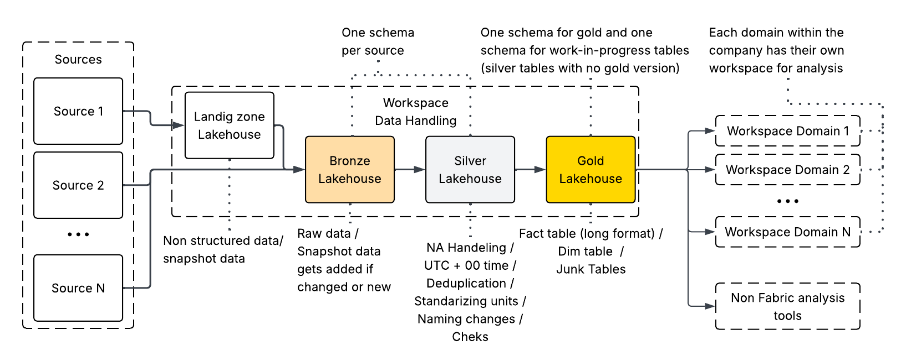

# Medallion Architecture in Fabric
The data architecture implemented in Microsoft Fabric follows a modified version of the traditional medallion architecture and is structured as follows:

A core principle of this design is that all data processing and transformation take place within a **single workspace per environment**. The architecture is consolidated into exactly four lakehouses: **Landing Zone**, **Bronze**, **Silver**, and **Gold**. Restricting data storage to these specific lakehouses ensures optimal data governance, control, and traceability. A key assumption of this architecture is that the system contains no sensitive data. If sensitive data is present, a deeper analysis of its specific sensitivity and required compliance measures must be conducted.

> [!NOTE]
> Real Time Analytics is excluded here as I do not have much experience with it

## Landing Zone
The primary modification from a standard medallion architecture is the introduction of a dedicated Landing Zone lakehouse. This layer serves two essential purposes:

1. **Handling Unstructured Data:** The Landing Zone acts as a repository for unstructured data, allowing the preservation of original files in their raw format. To ensure maximum analytical efficiency, only structured data is processed and promoted into the Bronze, Silver, and Gold layers.
2. **Historical Data Capture:** Certain source systems do not maintain historical records and only reflect the current state. A prime example is work order management software, which may display tasks as they are now, but does not track state changes over time. To capture history, daily or periodic snapshots owerwrites data in the Landing Zone. A comparison process checks for modifications against existing records before appending new or updated data into the Bronze layer.

## Bronze
The Bronze layer serves as the raw data repository. All data ingested from source systems is stored here in its native state to ensure a reliable audit trail.

* **Source-Based Schemas:** To maintain clear data lineage and easily identify data origins, a separate schema is dedicated to each individual source system.
* **Fabric Shortcuts:** Shortcuts can be utilized to reference data directly from external sources without moving it, provided that the data does not rely on the snapshot or processing logic managed in the Landing Zone.

## Silver
The Silver layer is where data cleansing, validation, and standardization occur. This layer transforms raw data into a reliable enterprise asset through several key processes:

* **Data Quality & Transformation:** Activities include deduplication, standardized date/time parsing, unit alignment, and handling of missing or null (`NA`) values.
* **Source-Based Isolation:** Similar to the Bronze layer, the Silver layer maintains separate schemas per source system to ensure traceability and modular data pipeline management.
* **Data Quality Gates:** Critical reference data, such as master data, undergoes strict validation checks. Because of its critical impact on downstream analytics, this data is heavily audited to ensure it complies with required formats and contains no invalid null values before it is advanced. If there are valuable master data that is missing, the data owner is alerted.

## Gold
In the Gold layer, data is optimized and structured specifically for business intelligence and data analytics.

* **Dimensional Modeling:** Data is organized using a star schema design, split into distinct dimension (`dim`) and fact (`fact`) tables (including junk dimensions if required by the data model). Before proceeding, you can review the specific [definition of dim and fact tables here](tables_structure.md).
* **Dual-Tier Schemas:** To balance agility with data governance, the Gold layer is divided into two distinct schemas based on data maturity:
    1. **Gold Standard Schema:** Contains fully verified, modeled, and certified tables that strictly adhere to organizational data quality and performance standards. Dimension and fact table names must remain strictly independent of any specific data source or business domain. This is because data from multiple sources is integrated and blended within these tables. Source or domain naming follows a silo thinking when presented to the public. Naming conventions should follow a standardized, predictable prefix format, such as `dim_...` and `fact_...`. 
    2. **Staging/Pending Schema:** Contains tables that the organization immediately requires for operational reporting but have not yet been fully refined for advanced analytics. For ease of deployment, these tables are exposed directly from the [Silver](#silver) layer through shortcuts in order to grant quick access while the formal Gold-standard pipeline is being developed.

To read more about the internal structure of the tables themselves, click [here](tables_structure.md).

## Domain-Driven Workspace
Each business domain should have its own dedicated workspace to host its reports, semantic models, and related Fabric objects. While isolating assets by domain might appear to reinforce data silos, cross-domain collaboration is enabled by sharing relevant reports across domains. This makes it easier to understand the context behind the report, where business logic might differ between domains.