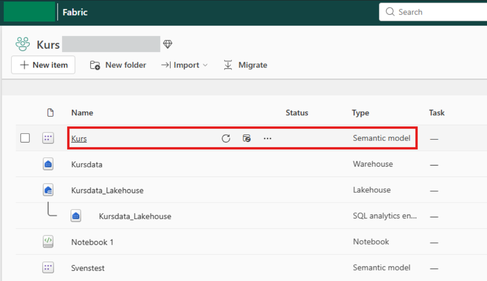
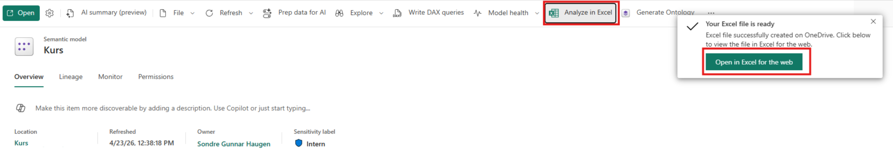
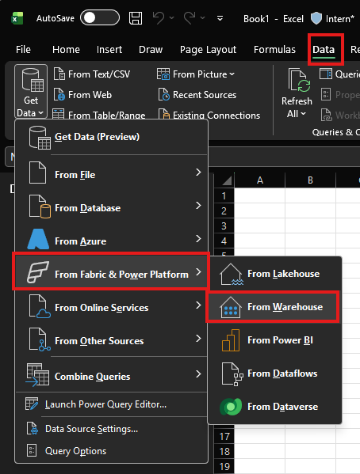
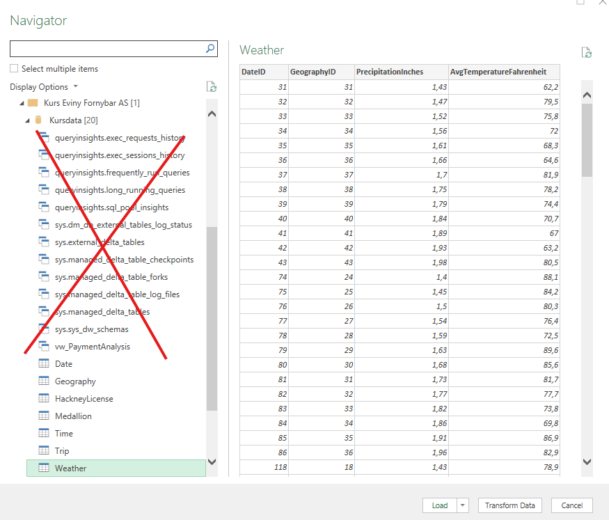
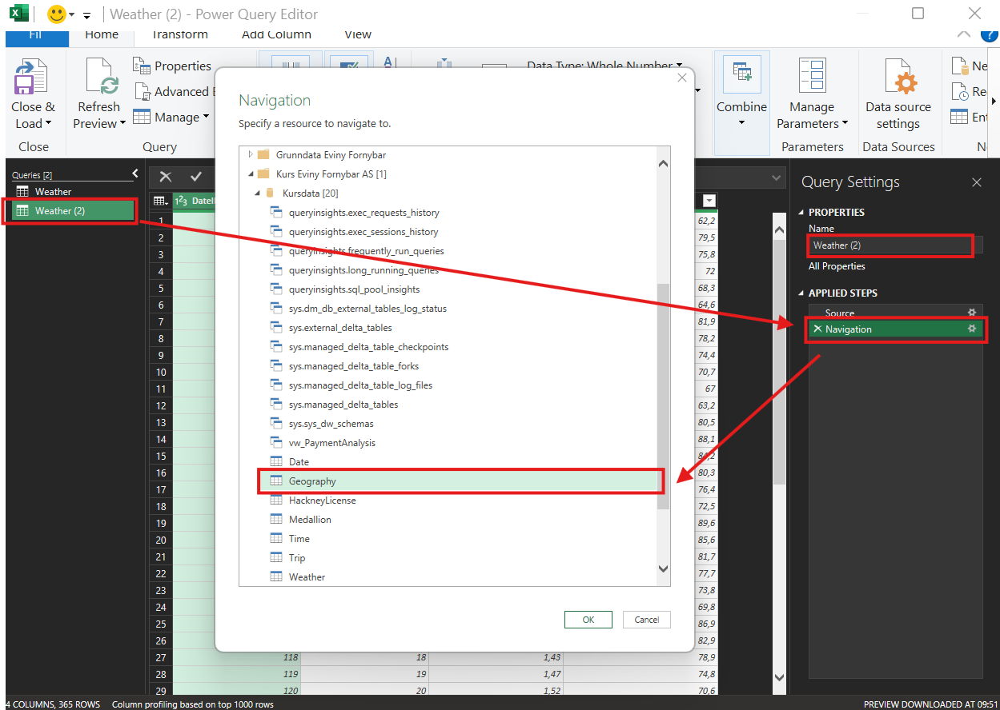

# Connection with Excel

In Excel, there are different methods for connecting to data in Microsoft Fabric Lakehouse: [querying the data model](#querying-the-data-model) and [direct import](#direct-import-to-excel).

## Querying the Data Model

Dedicated data models have been created in Fabric that aggregate data from multiple tables. The limitation of this method is that the data is presented as PivotTables, which you can adjust as desired based on the data model. The procedure is as follows:

From here, you can work in the web version or proceed to the desktop version if preferred.

## Direct Import to Excel

To connect to data in Fabric through Excel, remember to select **Warehouse**:

Then, select the table you wish to import (disregard the crossed-out tables, as these are standard tables that do not contain relevant data):

If you need to retrieve multiple tables simultaneously, click "Transform Data," copy the selected table, and change the source (remember to also change the name afterward):

