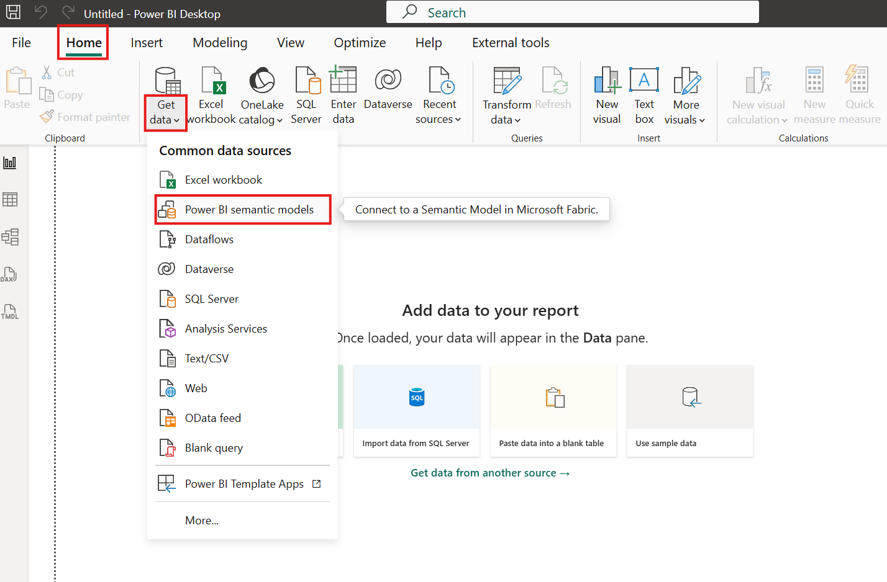
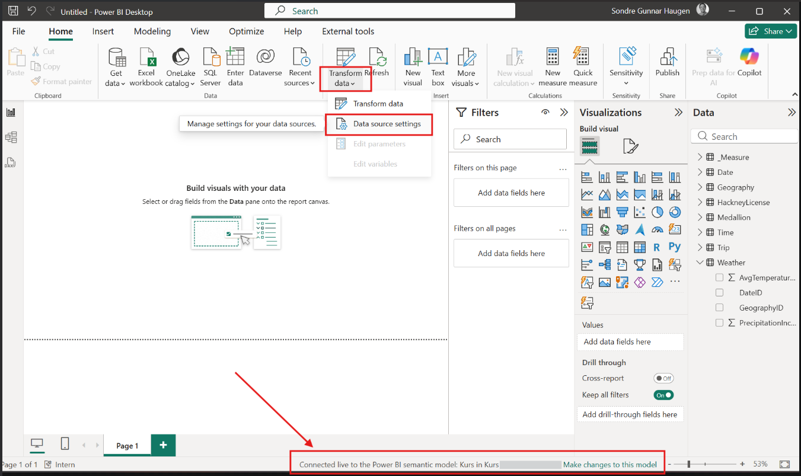
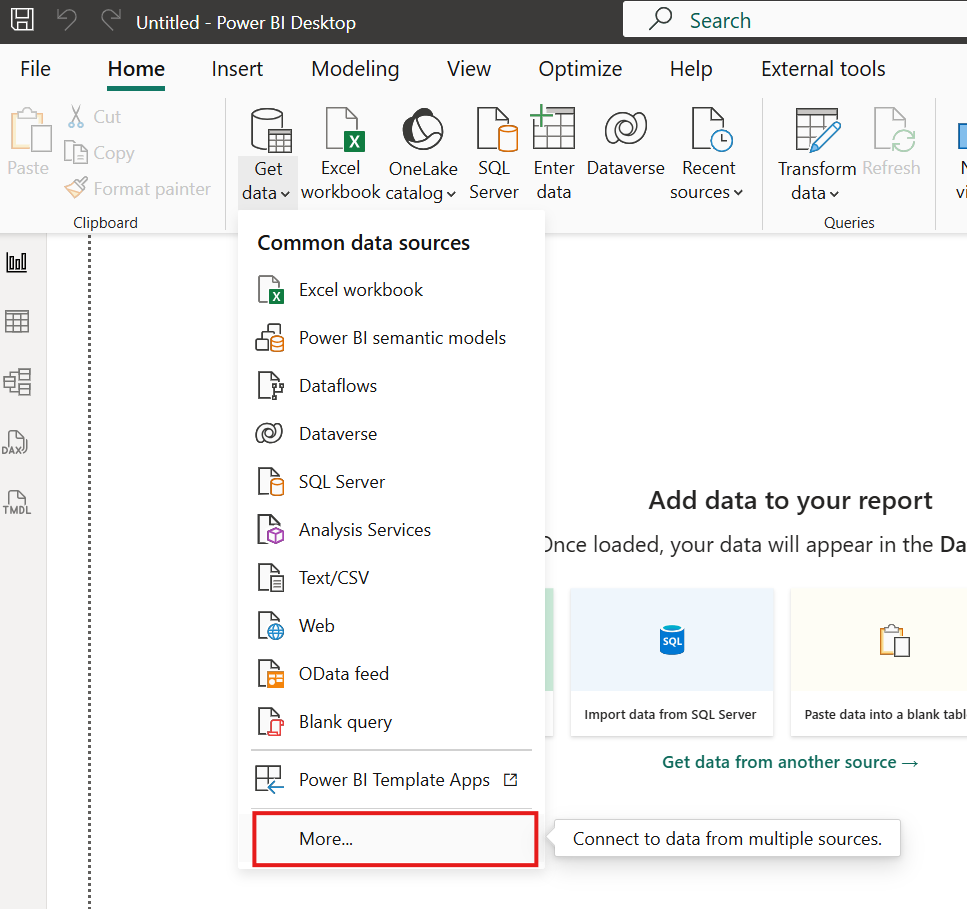

# Power BI Connection

Three methods are used for data acquisition: [Direct Lake](#direct-lake-anbefalt), [Import](#import), and Direct Query. [Direct Query](https://learn.microsoft.com/en-us/power-bi/connect-data/desktop-directquery-about) is rarely used as it looks at live data and reduces Power BI's functionality.

## Direct Lake (recommended)

[Direct Lake](https://learn.microsoft.com/en-us/fabric/fundamentals/direct-lake-overview) is a method that pulls data into the Power BI report without storing the data within the report itself. All data remains in the cloud. To connect using this method, follow these steps:

If you want to see what you are connected to or how to switch the semantic model, you can do so here:

## Import

Import pulls all data into Power BI. This is typically used when importing data from Excel sheets, Web, CSV, and similar files. You can access it here:

