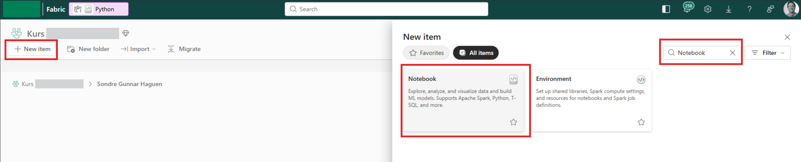
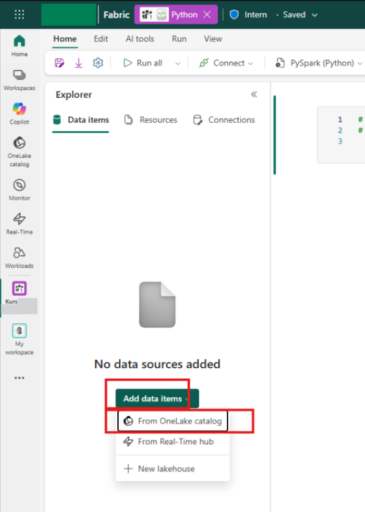
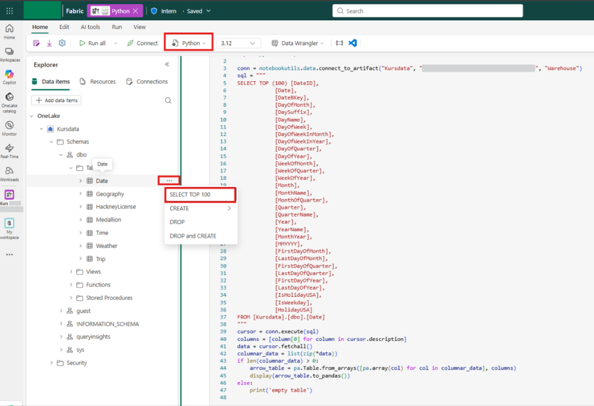

# Connection with Python

Here are multiple methods of how to connect python to data in Fabric. IDE chosen is VS code, but other can be used.

## VS Code

Multiple methods are available for retrieving data using Visual Studio Code (or other IDEs). Before proceeding, ensure that VS Code and Python are installed on your system.

### One-time installation
For all solutions, the **Azure CLI** must be installed to authenticate with Fabric. Open the terminal in VS Code (**Ctrl + Ø** on Windows) and run the following command:

```bash
winget install Microsoft.AzureCLI

```

### Login

Before you can retrieve data from Fabric, it is important that you log in with your user.
Open the terminal in VS Code (Ctrl + ø) and enter this text:

```bash
az login --tenant <YOUR_TENANT_ID_OR_DOMAIN>
```

> [!Note]
> Specifying the tenant for those accounts that are connected to multiple tenants

A window will pop up and you log in with your user.

### GraphQL

Before accessing the data, verify with the Lakehouse administrator that a GraphQL API has been created and that your target table is included in its schema.

Once confirmed, run the following script: [connectToGraphQL](scripts/connectToGraphQl.py)


### SQL connection

Before you can start, it is important to carry out further installations for this approach:

#### Additional one-time installation
1. **OBDC Driver 18 for SQL Server** - [Download driver for OBDC Driver 18 for SQL Server](https://learn.microsoft.com/en-us/sql/connect/odbc/download-odbc-driver-for-sql-server?view=sql-server-ver17) that suits your PC
2. . Python libraries - Open the terminal in VS Code (Ctrl + ø) and enter this text:

```bash
pip install pandas sqlalchemy pyodbc azure-identity

```

> [!Note]
> Remember to close and open VS Code after the installation finished for the packages to work correctly

#### Get data from Fabric

After you have [logged in](#login), you must also remember to [retrieve the SQL endpoint](sql.md#retrieving-sql-analytics-endpoints).

Afterwards, you can run this code: [connectToFabric.py](scripts/connectToFabric.py)

## Fabric (only for those with right subscriptions)

In Fabric, it is possible to code in Python using [Notebooks](https://learn.microsoft.com/en-us/fabric/data-engineering/how-to-use-notebook). This is how it is done:



Next, add the SQL Endpoint (Warehouse):



Finally, select Python and right-click on the table to retrieve data (Fabric automatically generates the r code):



Make any necessary changes to the SQL query and use

```python
df = arrow_table.to_pandas()

```

to save it as a dataframe. **NOTE:** The first time you run the code, it will take some time to establish the connection to the data:

