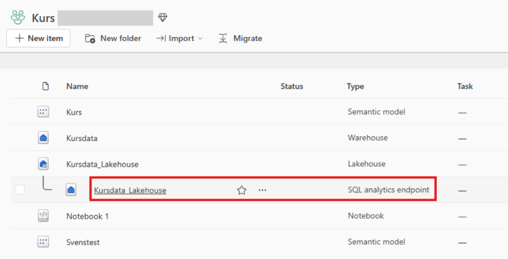
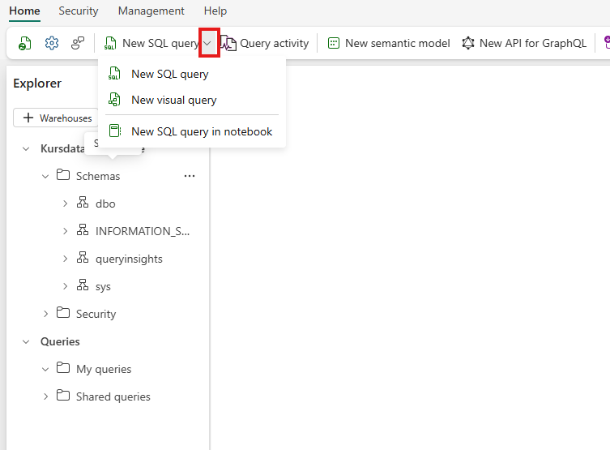
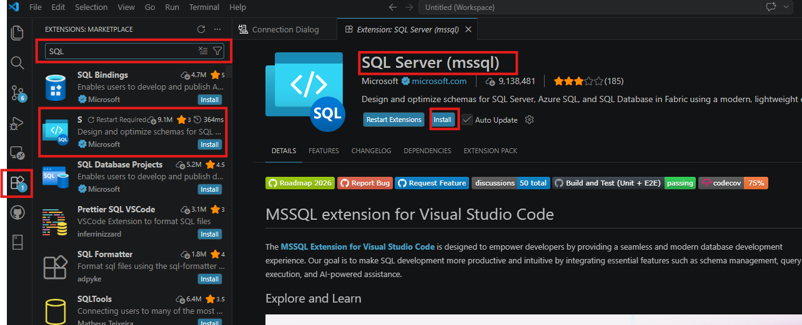
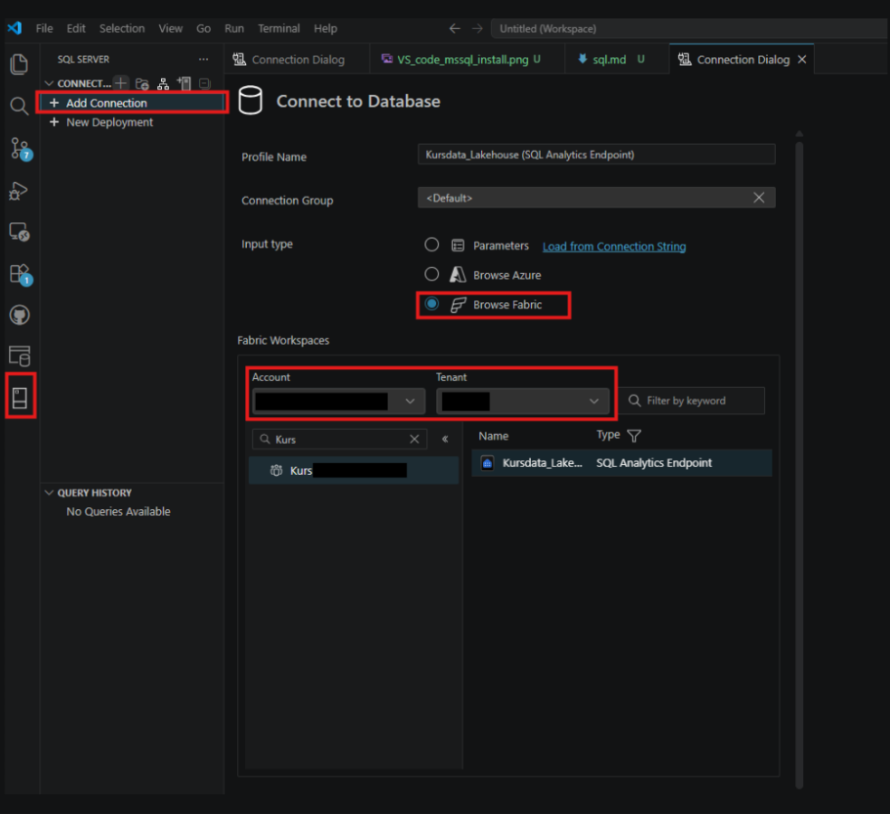
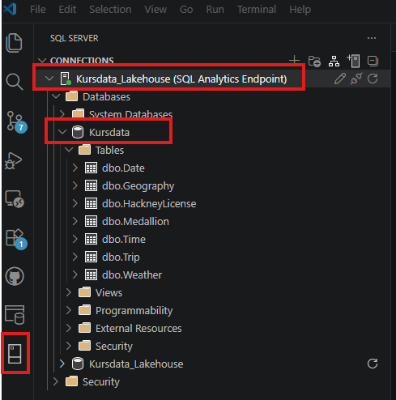
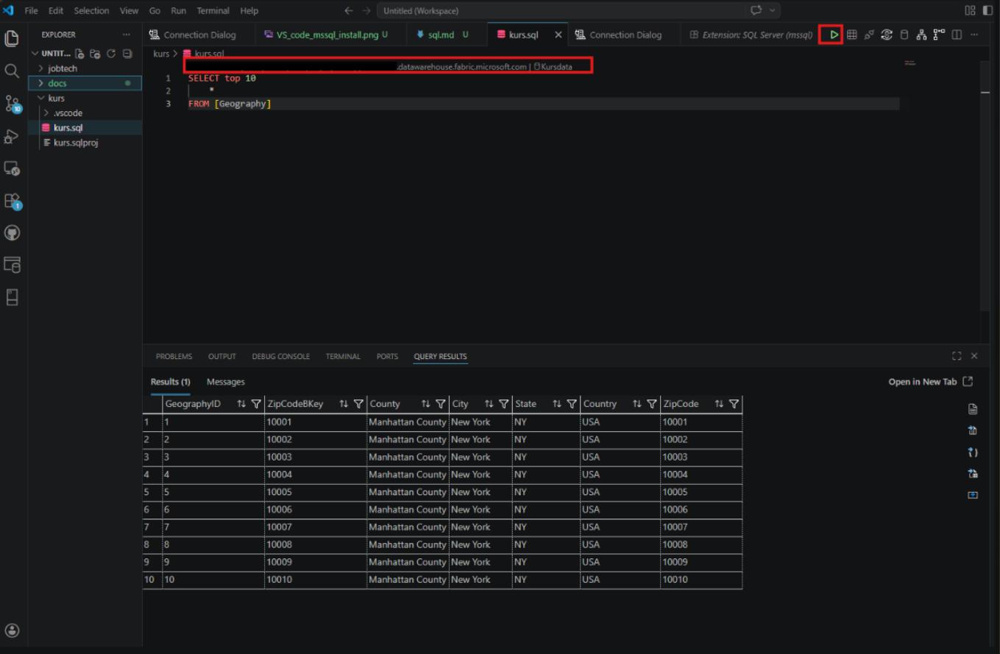
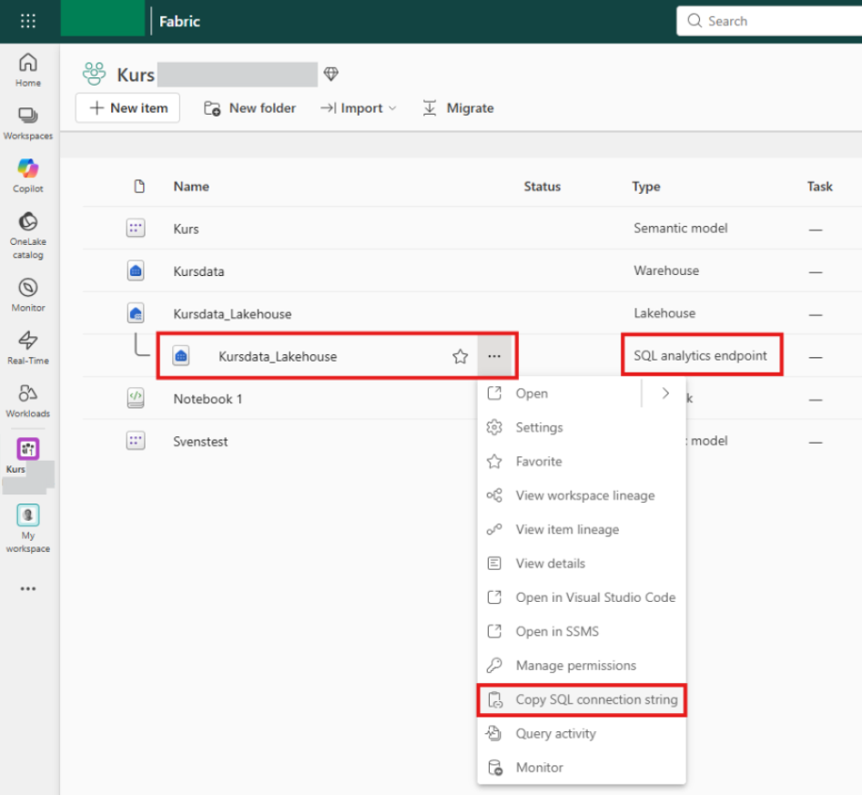
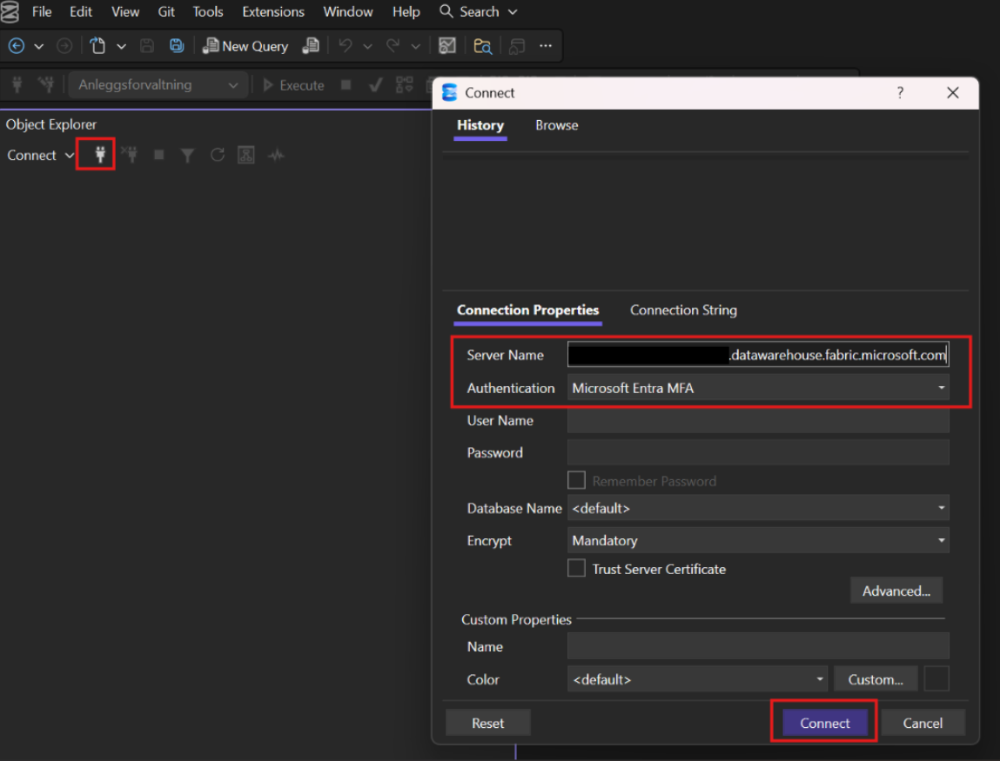
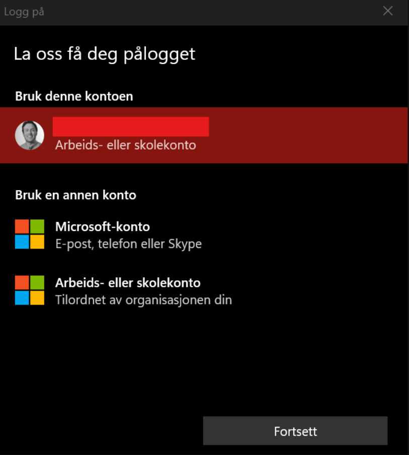

# Connection with SQL

## Fabric

In Fabric, you can also run SQL queries directly within the platform. Click on the lakehouse:

Then click on "New SQL query" and choose your preference:

## VS Code

First, download MSSQL:

Then, create a connection:

Check that you have connected:

Next, create a .sql file, press **Ctrl+Shift+P**, and type *MS SQL: Connect*. Select the desired connection. When creating a SQL query, ensure it is linked to the correct connection:

## Retrieving SQL Analytics Endpoints

Go to the workspace where the data is located and find a lakehouse/warehouse. Then, locate the SQL analytics endpoint and copy it:

## SQL Server Management Studio (SSMS)

Use [SSMS](https://learn.microsoft.com/en-us/ssms/sql-server-management-studio-ssms) for this procedure. Use the link you found in [SQL analytics endpoint](#retrieving-sql-analytics-endpoints) for the "Server Name":

Then, authenticate using the following account:

