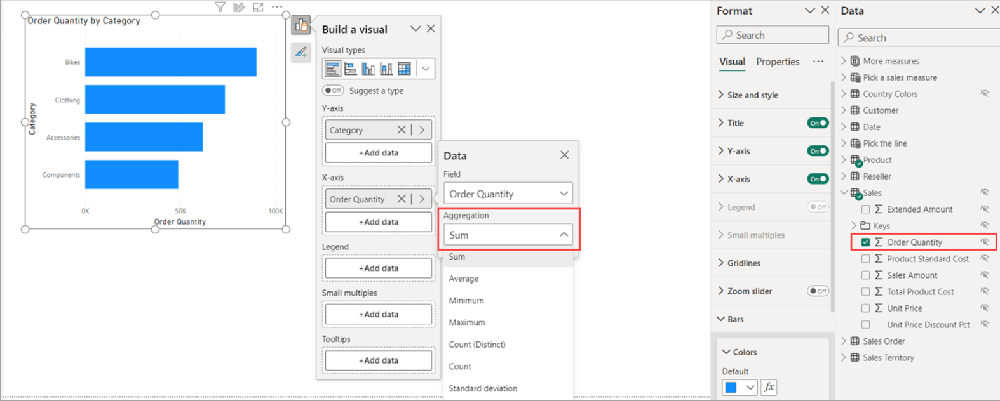
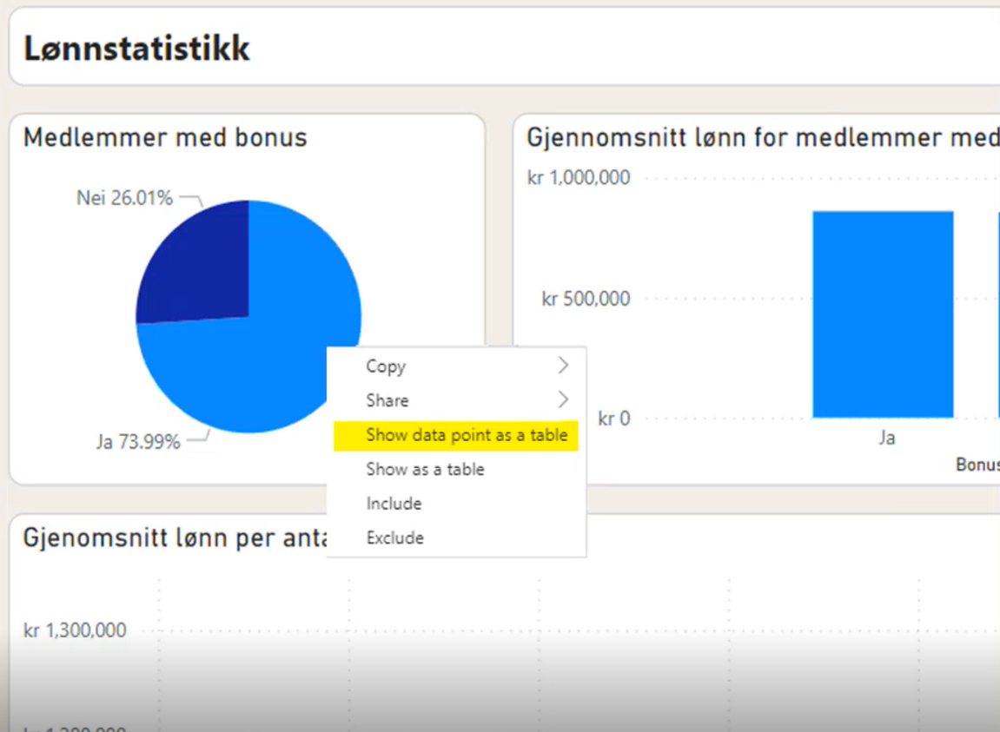
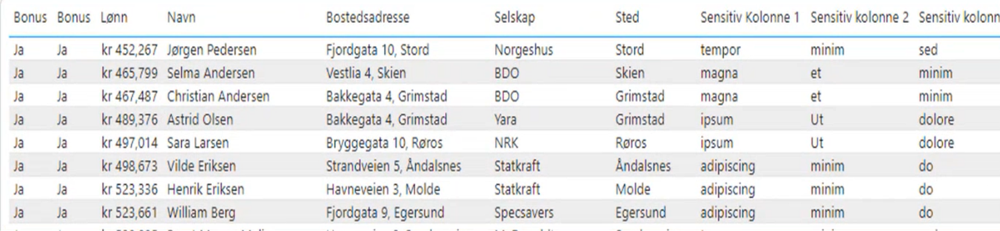

# Implicit vs Excplicit Measures

In Power BI, the core difference between implicit and explicit measures comes down to how the calculation is created and where it can be used: 
* [Implicit measures](https://learn.microsoft.com/en-us/power-bi/transform-model/desktop-tutorial-create-measures#automatic-measures) are created automatically by dragging columns into visuals
* [Explicit measures](https://learn.microsoft.com/en-us/power-bi/transform-model/desktop-tutorial-create-measures#create-and-use-your-own-measures) are created manually using [DAX](../semantic_model/dax.md). 

Example of implicit measure: 

## Always use Explicit Measures
While implicit measures offer quick convenience, they pose a data governant risks through the feature [Show data point as a table](https://learn.microsoft.com/en-us/power-bi/explore-reports/end-user-show-data?tabs=powerbi-desktop#use-data-point-table-in-power-bi-desktop). This is a feature only available with implicit measures, and it gives access to the underlying data at row level. 

Below is an example where the visuals shows the percentage of employee that have bonuses. However, if you select the *show data point as a table*, then the whole underlying table is available showing each employees salary (lønn):

**Other reasons to use Explicit Measures**
* More flexible calculations
* Easier formatting options