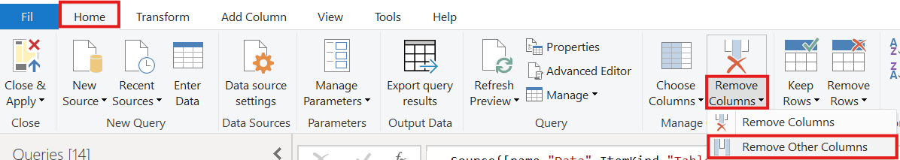
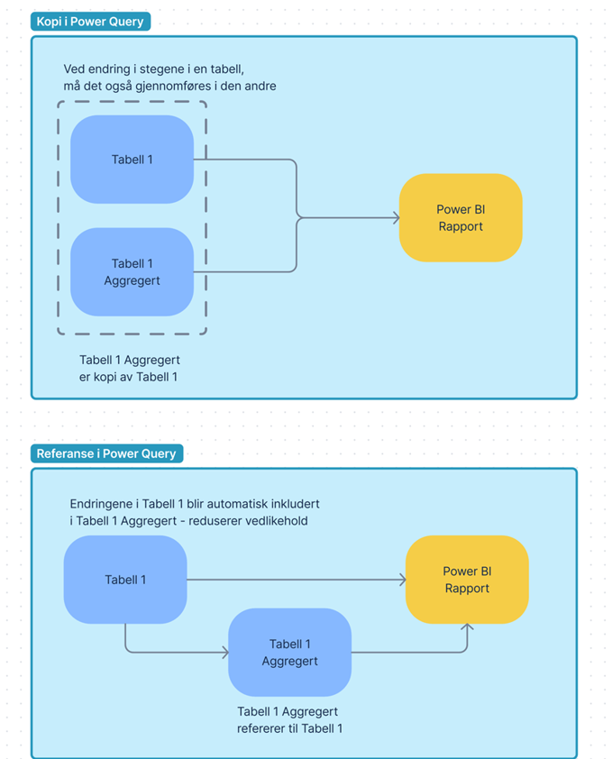
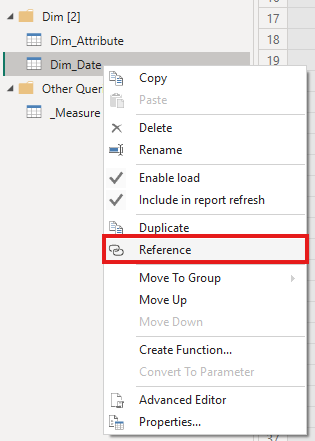
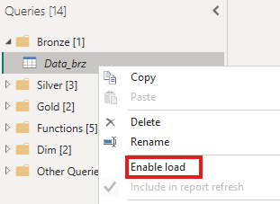
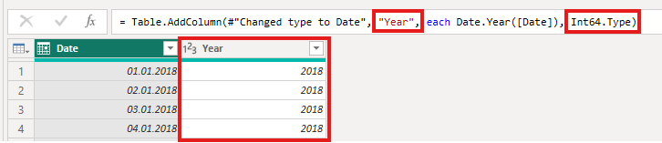

# Functions

Utilizing specific built-in Power Query features can significantly streamline ETL processing, reduce model complexity, and improve dataset maintainability. Here are the list of functions discussed
* [Remove Other Columns vs. Remove Columns](#remove-other-columns-vs-remove-columns)

## "Remove Other Columns" vs. "Remove Columns"

A core Power BI best practice is to load only the data necessary for your analytical requirements. While both **Remove Columns** and **Remove Other Columns** remove unneeded fields from your query, they handle schema changes differently under the hood.

**Always prefer "Remove Other Columns".**
1. **Resilience to Schema Drift:** If new columns are added to the source database in the future, **Remove Columns** will automatically include those new fields in your refresh pipeline, polluting your model with unexpected data. In contrast, **Remove Other Columns** hardcodes only the explicit list of required fields, automatically filtering out any new, irrelevant columns added upstream.
2. **Immediate Error Detection:** If a required source column is dropped upstream, **Remove Other Columns** immediately throws an error during refresh, preventing broken reports or silent data loss.

*(How to Remove Other Columns)*

## "Reference" vs. "Duplicate" Queries

While both operations generate a new query derived from an existing table, they serve fundamentally different architectural purposes.

* **Duplicate:** Creates an independent copy of the original query and all its M code steps. Any subsequent logic updates applied to the original table must be manually repeated in the duplicated table.
* **[Reference](https://learn.microsoft.com/en-us/power-bi/guidance/power-query-referenced-queries):** Creates a dependent query that inherits the final output of the source query as its starting point.

**Best Practice:** Use **Reference** to [centralize transformation logic](https://learn.microsoft.com/en-us/power-bi/guidance/power-query-referenced-queries#recommendations). One implication is that the referenced table will retrieve data as many times as it is [referenced](https://learn.microsoft.com/en-us/power-bi/guidance/power-query-referenced-queries#scenario).

**Example:** Consider a scenario requiring two tables: a detailed transaction table protected by Row-Level Security (RLS) and a high-level aggregated summary table. By creating the detailed table first and **referencing** it to create the summary table, any cleaning, filtering, or column renaming automatically flows into both tables, reducing maintenance and guaranteeing cross-table consistency.

*Figure 9 - Reference vs. Duplicate*

### How to Reference
Right click on the table and select reference:

*Selecting Reference*

## Disabling "Enable Load" for Intermediate Queries

Staging or helper queries used purely as intermediate transformation steps should **never** be loaded into the Power BI semantic model.Loading intermediate queries wastes RAM, inflates dataset storage size, increases refresh times, and clutters the report canvas field list. To prevent an intermediate query from loading into the model:

1. Right-click the query in the Queries pane.
2. Uncheck **Enable Load**.

In the Power Query Editor, queries with **Enable Load** disabled are visually identified by *italicized query names*.

*Figure 10 - Disabling Enable Load*

## Defining Data Types Within Custom Column Steps

When adding a custom column in Power Query, define the data type directly within the M code function step rather than adding a separate **Changed Type** step immediately after. Including the data type inline eliminates unnecessary transformation steps and keeps the **Applied Steps** pane clean.

*Adding inline data types in Power Query*

## Power Query Custom Columns vs. DAX Calculated Columns

As a general rule, custom columns should be created in **Power Query** rather than as DAX Calculated Columns. Even though Power Query usually needs less storage than DAX calculated columns, the choice depends on which calculations should be done: 
* Power Query does not excel on calculations across rows like cumulative sum, where DAX is better at this.
* With incremental refresh, then Power Query is better as it only does the calculations for new rows, while DAX calculates it for all rows.

For more information, see this [video from SQLBI](https://www.youtube.com/watch?v=-x2dLTtKiR8)