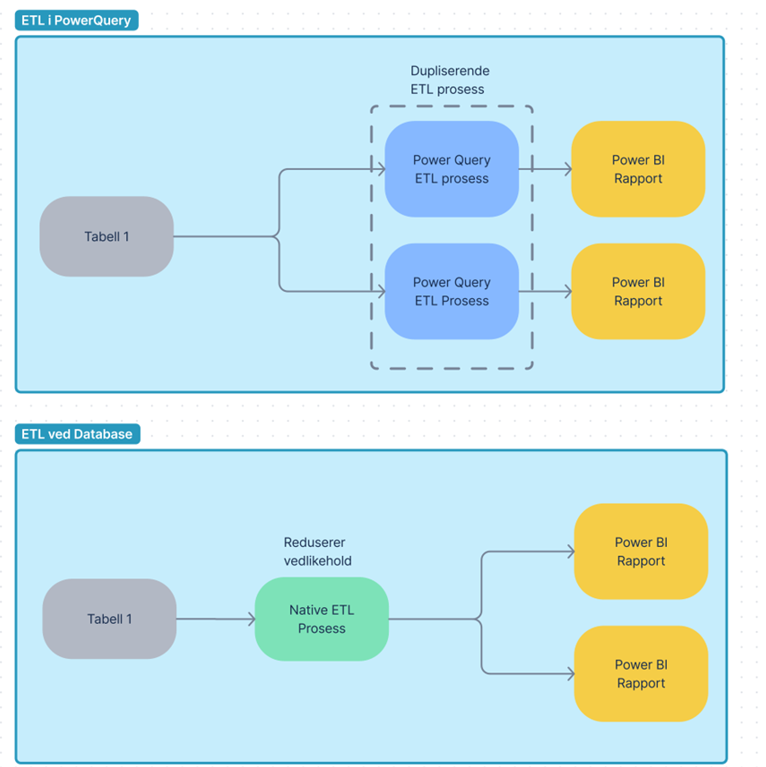
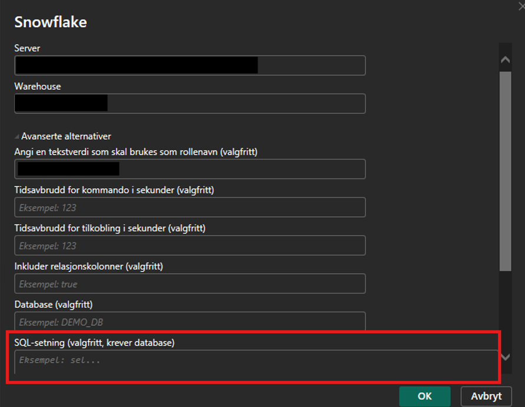

# Minimizing Power Query Usage

Although Power Query offers a wide array of transformation capabilities, it should not be used for heavy data processing. Power Query is generally less efficient for enterprise transformation tasks compared to dedicated data processing engines using SQL or Apache Spark. As a result, data transformations should almost always be executed as close to the source database as possible.

A primary benefit of shifting transformations upstream into the database is cross-report consistency. When business logic is applied at the database level, it automatically governs every report consuming those tables, dramatically reducing maintenance overhead.

> **Example:** If two separate reports source data from *Table 1* and all transformations are executed within Power Query, any logic change must be manually applied across both Power BI files. Conversely, if that logic is defined directly in the database, a single update is instantly reflected in both reports—ensuring a single source of truth and minimal maintenance.

## Native database query

To reduce the usage of Power Query, it is recommended to use [native database query](https://learn.microsoft.com/en-us/power-query/native-database-query) if you are connected to a SQL database that is [supported](https://learn.microsoft.com/en-us/power-query/native-database-query#connectors-that-support-native-database-queries) for all transformation. This method minimizes the Power Query usage. Here is how to do it:

