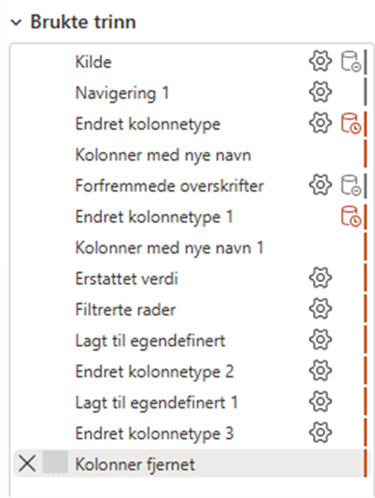
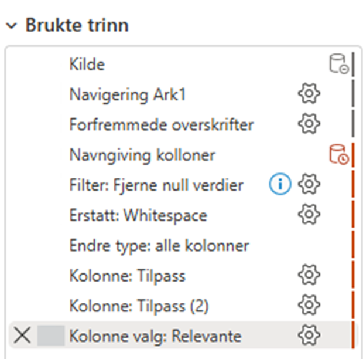
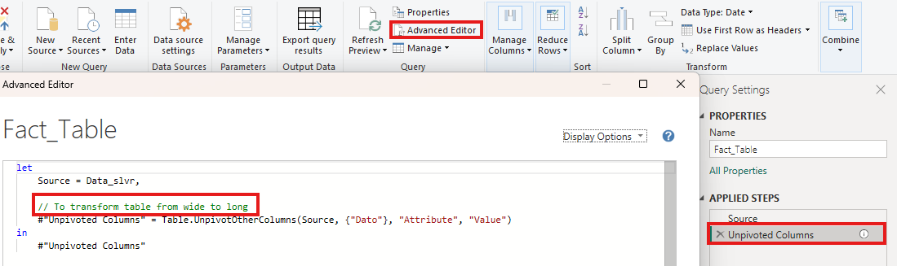

# Minimizing steps

If transformation cannot happen at the [database level](minimize_power_query.md), then first get to know [Query Folding](query_folding.md) and then follow these instructions. The primary goal when organizing Power Query transformations is to minimize the total number of applied steps while giving each step a clear, descriptive name. Below are examples of bad and best practice (text in norwegian):

*(Bad Practice)*

*(Best Practice)*

In the example above, the total number of steps was reduced from 14 to 9 without altering any underlying transformation logic. Redundant, repeated actions, such as renaming columns or changing data types multiple times across different steps, were consolidated. In *Figure for bad practice*, columns were renamed twice and data types were altered three separate times. In Figure 5, these operations were consolidated into single, unified steps.

## Early Filtering

Filtering out unnecessary rows and removing unneeded columns should occur as early in the transformation sequence as possible. Reducing data volume early accelerates downstream operations (such as custom column calculations or text transformations) by processing significantly fewer rows.

> [!NOTE] 
> **Note on Query Folding:** Ensure early filter operations rely on foldable transformations (such as basic value filters) so they are successfully pushed back to the source database engine as a `WHERE` clause rather than executed locally.

## Standardized Step Naming

Step names should be updated to reflect their specific function using categorical prefixes. Structuring names with clear categories makes the query lineage easy to audit:

* `Filter: Remove Null Values`
* `Column: Add Custom Category`
* `Transform: Clean Text Whitespace`

## Step Documentation & Comments

Notice the information icon ($\mathbf{i}$) next to the filter step in the figure below. This indicates that a comment has been added to the step's properties. Adding step comments provides immediate context explaining *why* a transformation was made, which is especially valuable for business logic definitions, complex M code, or specific row filtering rules. Here is how to do it: 

