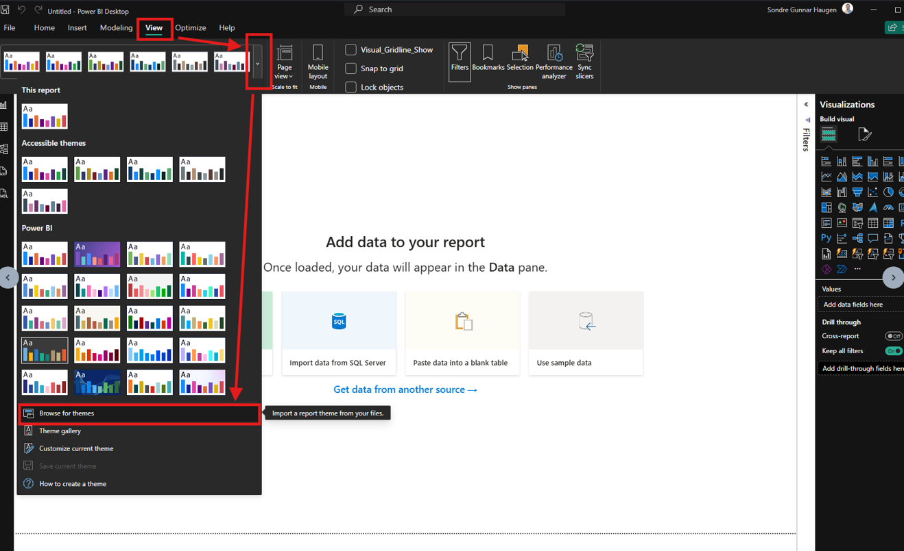

[Back to best practice report development overview](../index.md)

# Theme Template

[Theme templates](https://learn.microsoft.com/en-us/power-bi/create-reports/desktop-report-themes) are a way to automate visual styling and formatting across an entire report. This side includes the following topics:

* [Try my theme template](#try-my-theme-template) - A finishied theme template
* [How to use a theme template](#how-to-use-a-theme-template) - Step-by-step guide
* [Domain colors](#domain-colors) - Base colors for domains within the company.
* [Build your own custom theme template](#build-your-own-theme-template) - How to build

## Try my theme template
I have made a theme template that you can check out here: [Theme Template](theme_template.json). 

## How to use a theme template

## Domain Colors
To make it easy for users to recognize which type of report they are viewing, domain colors are recommended. These domains are the same domains as the workspace for the [business domains](../../architecture/medallion.md#domain-driven-workspace). This does *not* mean that other colors cannot be used, but rather that each domain has an associated color that makes it easy to identify. How a domain color would look like is something like this: 

See that they all have the same color as base to make it easy to recognize. Here are examples of domains and their potential colors:

| **Domain** | **Color** | **Hex Code** | 
| --- | --- | --- | 
| **Operations and Maintenance** | Forest Green | `#2D5A27` |
| **Sales** | Royal Blue | `#004A99` |
| **Finance** | Graphite Gray | `#4B4B4B` | 
| **HR / Administration** | Deep Teal | `#006D77` | 

## Build your own Theme Template
If you wish to build your own theme template, you can follow these links:

* [Find themable features](find_themable_features.md)
* [Not themable features](not_themable.md)
* [Bugs with theme template](bugs.md)
* [Microsoft Theme Template](https://learn.microsoft.com/en-us/power-bi/create-reports/report-themes-create-custom)
* [GitHub - How to assemble Power BI Themes](https://github.com/mattrudy/PowerBI-ThemeTemplates)