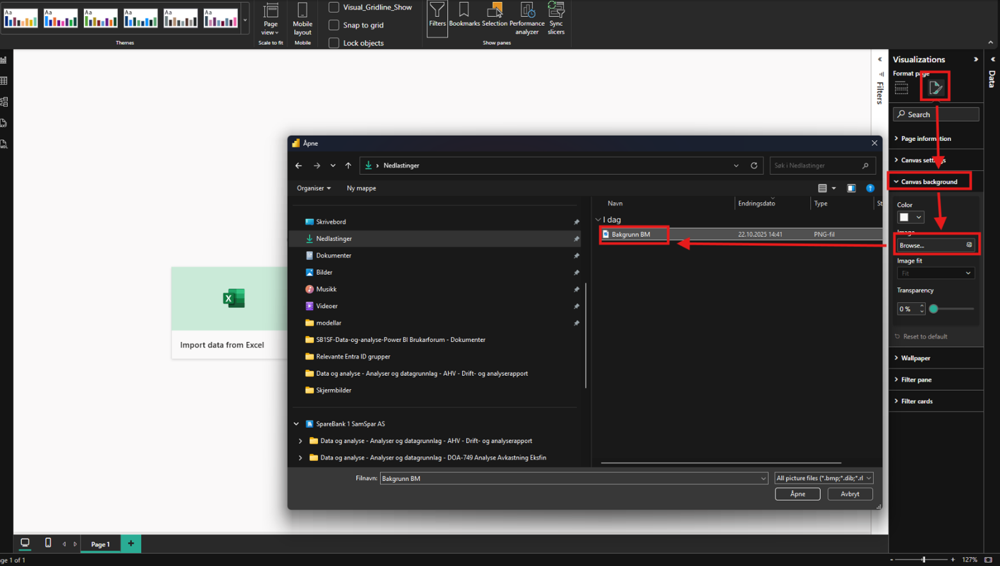
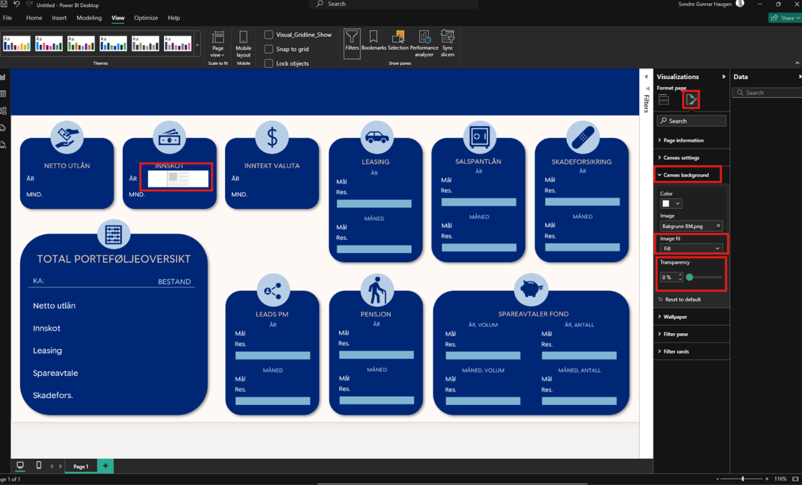

[Back to best practice report development overview](index.md)

# Backgrounds

There are several reasons to use backgrounds in Power BI. One of them, for example, is to reduce the number of objects on a page so that the report has better [performance](performance.md). However, this is only relevant to non-interactive, static shapes/texts. To make the background, [Power Point](https://learn.microsoft.com/en-us/office/client-developer/powerpoint-home) is an easy place to make them before screenshoting and saveing them. Here is how to use backgrounds in Power BI:

Then, set *Image fit* to **Fill**, or whatever fits the report best. Ensure that transparency is set to 0% (or your preferred value). When you add an element, it will look like this:

By using backgrounds, many separate objects on the page were replaced by a single background image.