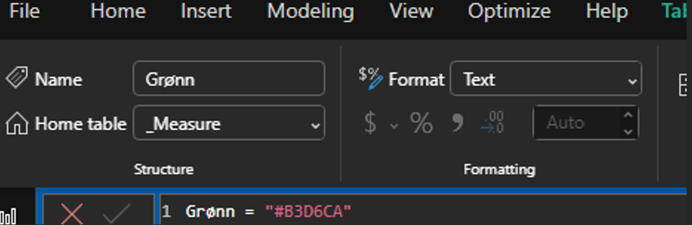
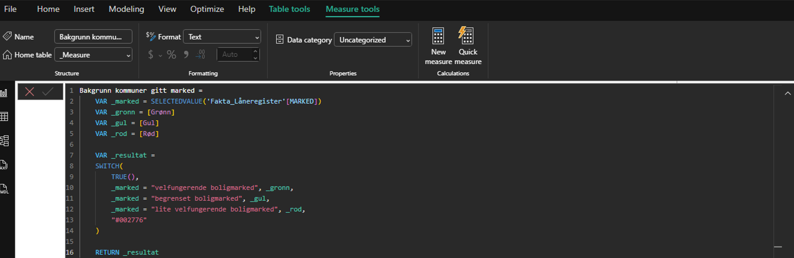
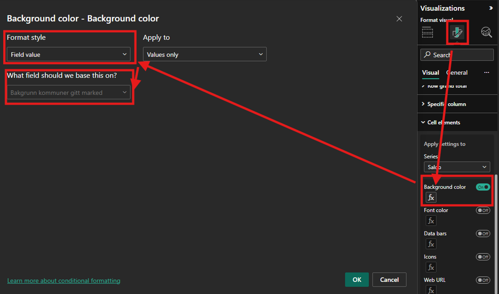

[Back to best practice report development overview](index.md)

# Conditional Formatting

[Conditional formatting](https://learn.microsoft.com/en-us/power-bi/create-reports/desktop-conditional-table-formatting) is dynamic formatting based on values. For example, you may sometimes want to distinguish data based on whether a goal is achieved or not. This can easily be done using Power BI's built-in conditional formatting function. However, it is recommended to use [measures](../semantic_model/dax.md) for this purpose. The advantage is that you can more easily change the condition and/or colors across all locations where the same conditional formatting is used, instead of updating them one by one. This reduces maintenance and minimizes the risk of errors.

A tip is to store colors in a measure like this:

The color can then be reused in several different conditional formatting settings as needed. This can be combined in a SWITCH function:

The measure *Bakgrunn kommuner gitt marked* first retrieves which market each municipality belongs to, then pulls in the corresponding colors. Finally, a SWITCH statement is used to determine which market is active and which color should be applied. At the bottom, a default color is defined to be used if none of the conditions are met.

If changes occur, updating the definition here will apply to all objects using the same measure. If you had used Power BI's built-in conditional formatting, you would have to change each individual object manually. To apply conditional formatting from the measure to objects, look for the *fx* icon and insert the measure:

