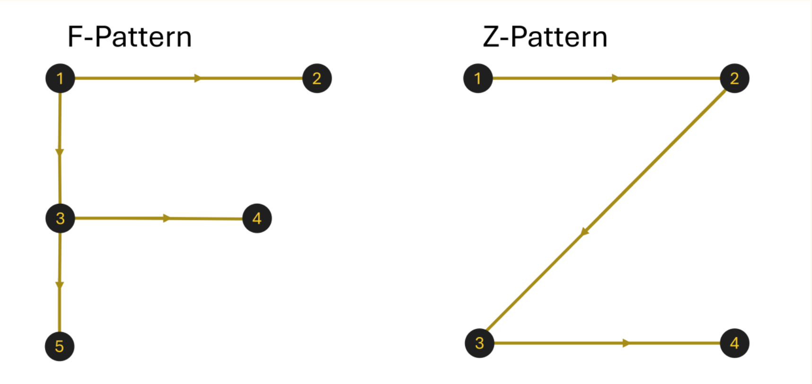
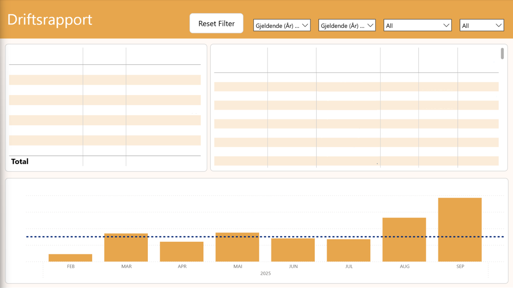
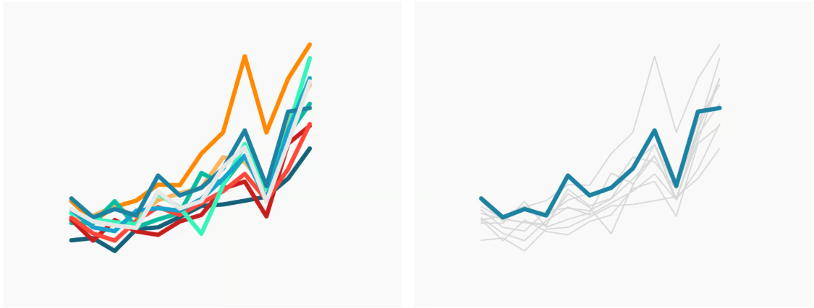

[Back to best practice report development overview](index.md)

# Best Practice - Design

## Thoughts Before Designing a Report

Before you start building a report, you should ask yourself: 
* What decisions or actions must users take?
* What data do they need to make those decisions?
* How can the report layout deliver this information as quickly as possible?

Remember that users have busy workdays, and the last thing they want is to have to search for information. The less time they have to spend in the report to find the information, the more often they will want to use it.

## Layout and Reading Patterns

Humans follow certain patterns when reading reports. One of the most important is the F- or Z-pattern, which illustrates how people scan reports and should be taken into account when designing your layout. These patterns look like this:

Given this pattern, the most important information should be placed at the top, preferably in the upper left corner.

## Colors

Colors is another powerful tool when designing reports. Used intentionally, colors group metrics, highlight insights, and can add meaning to report visuals. However, poor choices create visual noise and misdirect focus. Hence, making standardized report [templates](Theme_Template/theme_template.md) the best way to ensure clarity and consistency.

### Attention

Another factor than [layout](#reading-patterns) in drawing attention to something is how dominant the color is within the report:

The banner and the bar chart receive the most attention. A simple method to test this is to close and quickly open your eyes (*blink test*) to see which elements are captured first. If you want less focus on the bar chart, you can mute the color, as has been done for every other row in the tables. These rows are not meant to draw attention but rather to help distinguish content. The banner should have a stronger color to clearly describe what the report tab is about.

Also, note that there are subtle contrasts between the background and the various elements so they can be easily distinguished from one another. These are small adjustments, but they help the user intuitively differentiate between different data points. This balance is already maintained through the use of the design [template](Theme_template/theme_template.md) and [backgrounds](background.md).

### Less is More

Directing focus within a visual is also possible. To do this, use color selectively rather than decoratively. Mute secondary data series in gray and apply a single accent color only to the key metric you want to emphasize:

*Picture from [datawrapper](https://www.datawrapper.de/academy/what-to-consider-when-creating-line-charts)*

While the multi-color chart creates visual chaos, using gray with a single accent color instantly directs focus to the key metric. Muting secondary data simplifies comparison and reduces cognitive load for the reader.

### Assosiation

Colors tends to have assosiations attached to them given the context. For instance, 
in western financial context, red is often related to losses and green is related to gains, while in asia it is the opposite. It is therefore important to remember who the audience is before designing.

## Logo

It is not necessary to include the company logo in reports, as people know what company they work for. It usually only takes up unnecessary sace and draws attention away from the content. The exception is if the report is to be shared externally or if the report is being distributed to the entire organization as an official document.