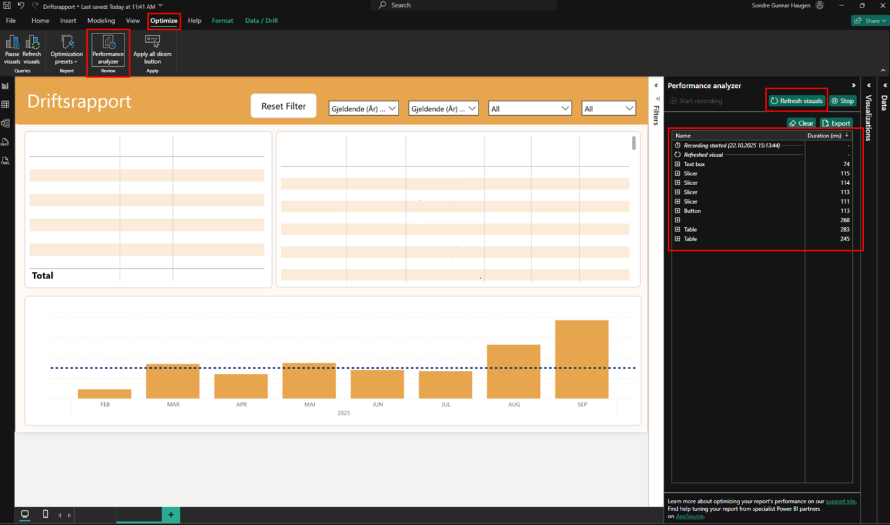

[Back to best practice report development overview](index.md)

# Performance

Visualizations should ideally update in **less than 1 second** and must take **less than 2 seconds**. This is because report adoption drops significantly if visualizations take more than 2 seconds to load when filtering or interacting. To ensure the highest possible performance, you can do the following:

* Maximum **6–8 visualizations** per page. Use [tooltips](https://learn.microsoft.com/en-us/power-bi/visuals/power-bi-visualization-tooltips-overview) if you need more information related to a value instead of creating a separate visualization.
* Avoid complex [DAX calculations](../semantic_model/dax.md).
* If you have many objects such as shapes and text boxes, it may be beneficial to use a [background](background.md) instead.

## Check Performance in Power BI

To test performance, you can follow this procedure in Power BI:

