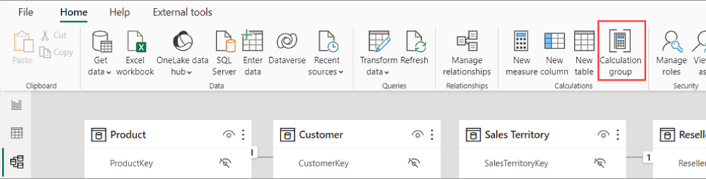

# Calculation Groups

[Calculation groups](https://learn.microsoft.com/en-us/power-bi/transform-model/calculation-groups) reduses the problem of redundant measures. It allows you to define reusable calculation logic once and apply it across any measure in your data model. The most common use case is to use if for [inactive relationships](star_schema.md#active-vs-inactive-relationships-role-playing-dimensions) and [time intelligence](time_intelligence.md).

## Example: Inactive Relationships
Assume `Fact_Sales` has both an `Order Date` and a `Ship Date` relationship to `Dim_Date`, where `Order Date` is active and `Ship Date` is inactive:

```text
Active = 
    CALCULATE(
        SELECTEDMEASURE(), 
        USERELATIONSHIP( Fact_Sales[FK_OrderDate], Dim_Date[PK_Date] )
    )

Inactive = 
    CALCULATE(
        SELECTEDMEASURE(), 
        USERELATIONSHIP( Fact_Sales[FK_ShipDate], Dim_Date[PK_Date] )
    )
```

Adding this calculation group as a slicer lets a report author switch any measure between "Order Date" and "Ship Date" context. Filtering on `Dim_Date` still works normally, and no measure needs to be duplicated for each date role.

## Example: Time Intelligence
Instead of writing a separate measure for every time-intelligence variant, define each variant once as a calculation item and apply it to any base measure:

```text
YTD = CALCULATE( SELECTEDMEASURE(), DATESYTD( Dim_Date[Date] ) )

PY = CALCULATE( SELECTEDMEASURE(), SAMEPERIODLASTYEAR( Dim_Date[Date] ) )

% Growth = 
    VAR _today = SELECTEDMEASURE()
    VAR _last_year = CALCULATE( SELECTEDMEASURE(), SAMEPERIODLASTYEAR( Dim_Date[Date] ) )
    VAR _result = DIVIDE( _today - _last_year, _last_year )
    
    RETURN _result
        
```

Calculation items support *dynamic format strings* (so `% Growth` can render as a percentage even though the base measure is currency).

## How to make calculation group

