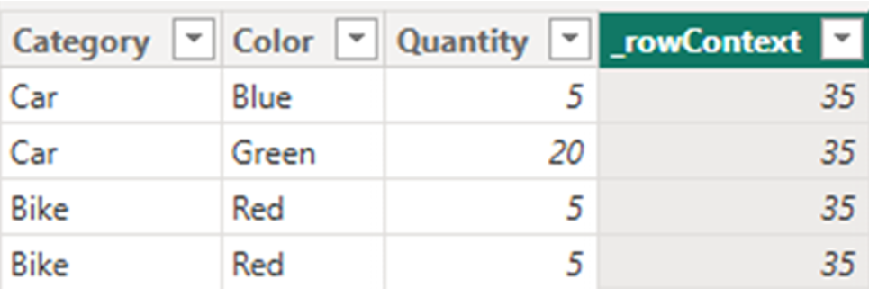
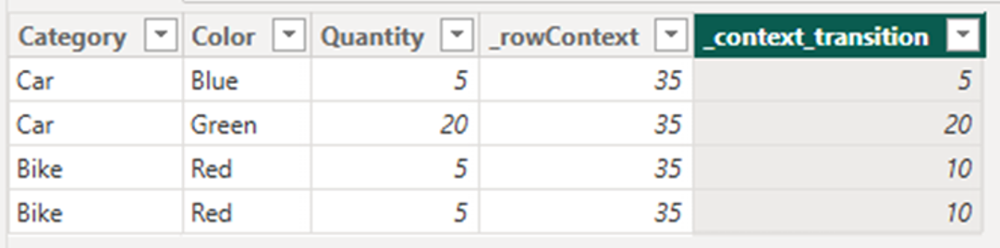

[Back to best practice data modeling overview](index.md)

# Context

## Context

In DAX, there are two different [contexts](https://support.microsoft.com/en-au/office/context-in-dax-formulas-2728fae0-8309-45b6-9d32-1d600440a7ad) in DAX calculations: [row context](#row-context) and [filter context](#filter-context). It is useful to be aware of these, as they affect the results of your calculations.

## Row Context

Row context refers to the current row that the DAX formula is operating on. When you use functions such as SUMX, AVERAGEX, or FILTER, the expression is evaluated for each row in the specified table. Row context ensures that the DAX formula can retrieve values from that specific row and use them in calculations.

**Example:**

```text
_rowContext = SUM( Sales[Quantity] )

```
> [!NOTE]
> SUM is the same as SUMX, but is a simplified syntax version 



## Filter Context

Filter context refers to the set of data filters that are active when a DAX formula is evaluated. This typically occurs when using slicers, report filters, or functions like CALCULATE, which can modify or extend the active filter.

**Example:**

```text
TotalSales2023 = CALCULATE( SUM( Sales[TotalAmount] ), Sales[Year] = 2023 )

```

Here, CALCULATE is used to change the filter context so that the sum only includes sales from 2023.

## Context Transition

Context transition happens when a row context is transformed into a filter context. This typically occurs when you use a function that creates a row context inside CALCULATE.

**Example**:

```text
_context_transition = CALCULATE( SUM ( Sales[Quantity] ) )

```

In this case, CALCULATE takes the row context and converts it into a filter context. This means the calculation will only include data that matches the current row's values as a filter.



As we can see, the result gives the same values as the Quantity column for the first two rows, but not for the last two. When we sum quantity we get 45 which is 10 more than the actual total.

The reason for this is Context Transition. When the calculation reaches row 3, CALCULATE creates a filter context based on the values in that row: Category = Bike, Color = Red, and Quantity = 5. Since there are two rows with these exact values, the filter retrieves both rows for both row 3 and row 4. In other words, the Quantity is double-counted because the values from both rows are included twice.

The same thing happens if a measure references another measure, as shown in the example below:

```text
_rowContextMeasure = SUM( Sales[Quantity] ) // Measure 
_context_transition = _rowContextMeasure   // Measure referencing another measure 

```

The reason for this is that Power BI automatically wraps a referenced measure in CALCULATE. Whats happening is that this:
```text
_context_transition = _rowContextMeasure   // Measure referencing another measure 
```
Becomes this: 
```text
_context_transition = CALCULATE( SUM( Sales[Quantity] ) ) 
```

This triggers a context transition, where the row context is converted to a filter context. If there are multiple rows with identical values, this will result in double-counting.

To avoid this problem, it is recommended to use an **index column** so that the filter context can distinguish between unique rows.