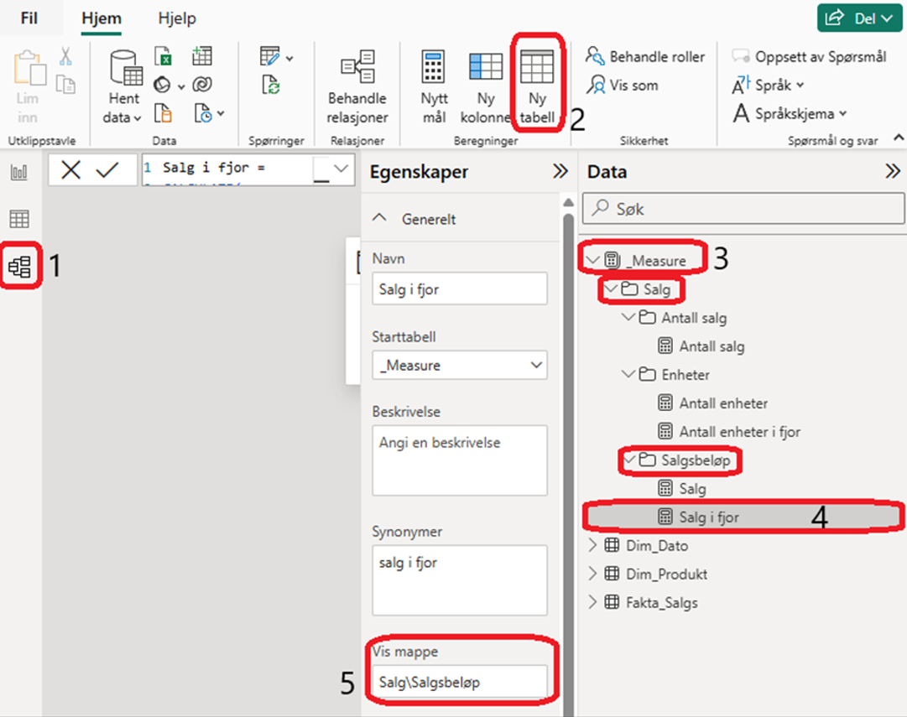

[Back to best practice data modeling overview](index.md)

# Measure table

To make it easier to find different calculations, they should be gathered in a separate table. Then, they should be organized into folders and subfolders to make them easier to navigate and retrieve.

To do this, go to the model view, add a new table, and call it "_Measure". Then create a measure, select the measure to open the properties tab, and specify the folder structure there (subfolders are created using \\). Also note that if a table contains only measures (delete the dummy column), the icon for the "_Measure" table will change to a calculator. To more effectivly work on the measures itself, and their folder structure, it is recommended to use Tabular editor

> [!NOTE]
> This table has no relationship and is only used to hold measuers

