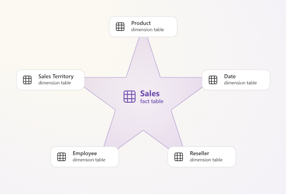
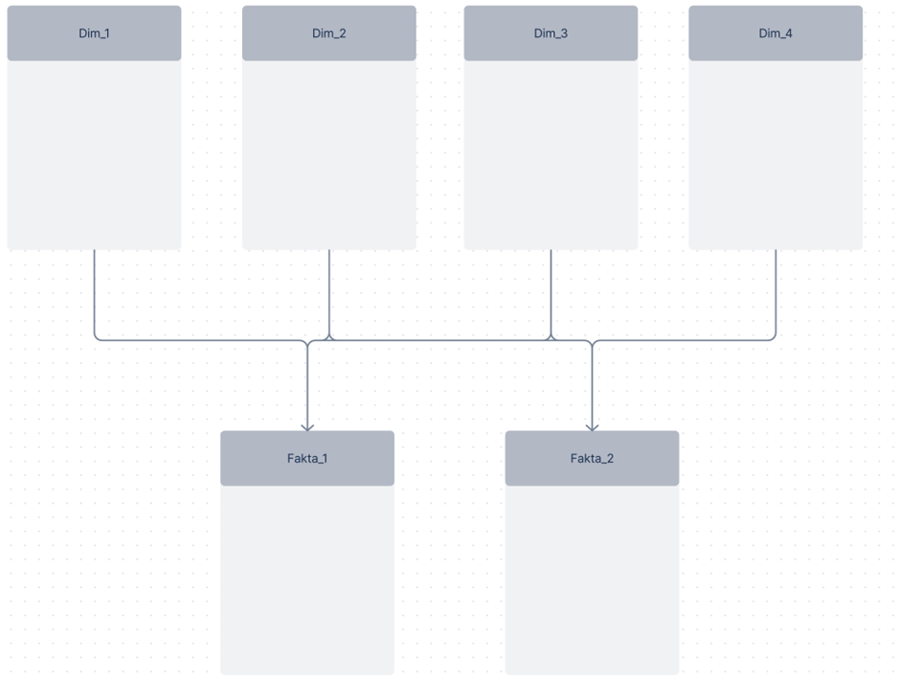

[Back to best practice data modeling overview](index.md)

# Star Schema

The most important aspect of data modeling is to strive, as far as possible, to use a [star schema](https://learn.microsoft.com/en-us/power-bi/guidance/star-schema), where the [fact table](../architecture/tables_structure.md#fact-tables) is surrounded by [dimension tables](../architecture/tables_structure.md#dimension-tables):

While a [snowflake schema](https://learn.microsoft.com/en-us/power-bi/guidance/star-schema#snowflake-dimensions) is a viable alternative, several key trade-offs should be considered:
* **Lower storage and performance efficiency** compared to flatter structures.
* **A less intuitive experience** for report authors.
* **Inability to create hierarchies** that span columns across multiple tables.
* **Longer filter propagation chains**, which can degrade query performance compared to single-table filtering.

## Relationships

For relationships, you should use one-to-many (many-to-one), where the dimension tables represent the "one" side and the fact table represents the "many" side, with a single [cross-filter direction](https://learn.microsoft.com/en-us/power-bi/transform-model/desktop-relationships-understand#cross-filter-direction). This ensures that only the dimension tables can filter the fact table, and not vice versa. If you have many-to-many relationships, there is likely an error in the modeling. If many-to-many is necessary, it is recommended to use a [bridge table](https://learn.microsoft.com/en-us/power-bi/guidance/relationships-many-to-many) as an intermediary. This allows the relationships to follow a many-to-one relationship to the bridge table, which then has a one-to-many relationship further on. Furthermore, it is recommended to avoid bi-directional cross-filtering, as this can reduce performance and potentially lead to resulterrors through ambiguous filter paths / circular relationship errors. 

### Active vs Inactive Relationships (Role-Playing Dimensions)

For relationships, there are also two different types: [active](https://learn.microsoft.com/en-us/power-bi/guidance/relationships-active-inactive#active-relationships) and [inactive](https://learn.microsoft.com/en-us/power-bi/guidance/relationships-active-inactive#inactive-relationships). Power BI only allows **one active relationship** between any two tables at a time. Any additional relationship between the same pair of tables becomes inactive by default.

* **Active relationship:** the default relationship used automatically for filtering and in [DAX calculations](dax.md).
* **Inactive relationship:** a connection between two tables that is *not* used for filtering or [DAX calculations](dax.md) unless explicitly invoked with `USERELATIONSHIP`. For best pratices of inactive relationship, see [calculation groups](calculation_groups.md).

It is generally advised against creating multiple physical copies in order to have active relationships. Example of this is duplicating `Dim_Date` to `Dim_Date_Order` and `Dim_Date_Ship`. The reason to avoid this is that it complicates the report for users and duplicates maintenance. Instead use [calculation groups](calculation_groups.md)

## Visual Representation of the Semantic Model

To make the model more understandable, it should not be visually organized as a literal star, but rather in distinct rows. Dimension tables are placed on the top row, while fact table(s) are placed on the bottom row. This provides a clear structure and makes it easier to see what filters what, especially in models containing many tables.

