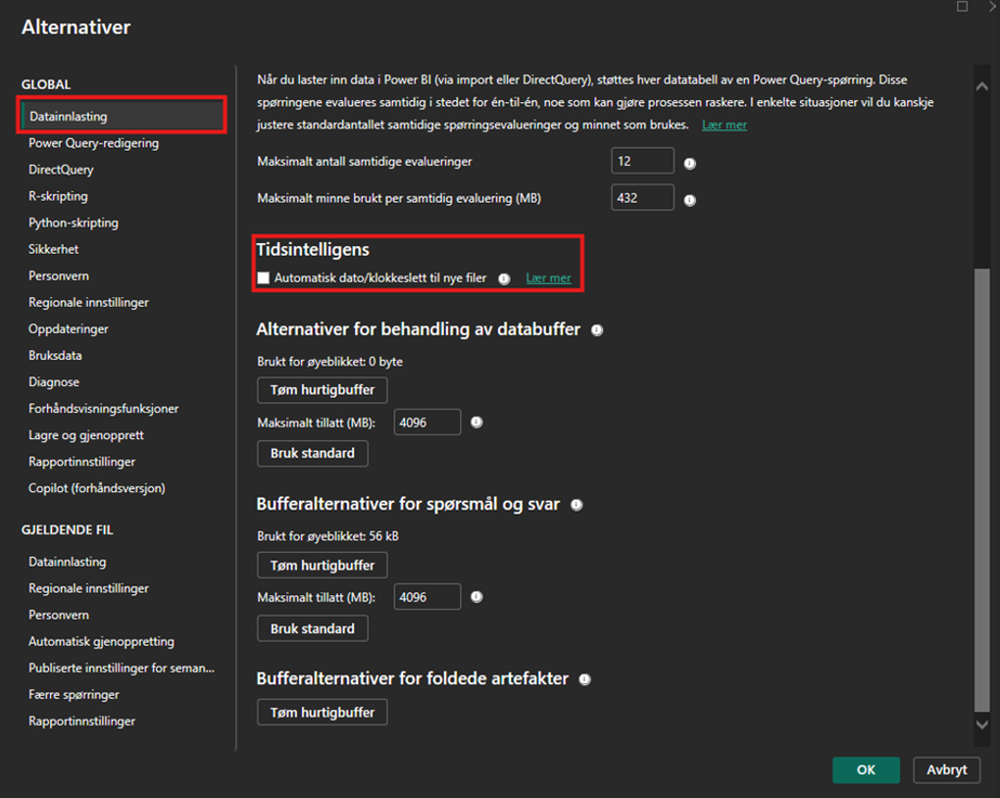
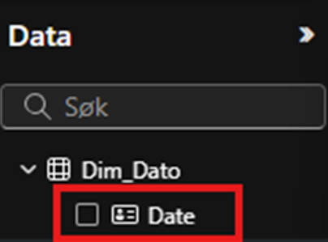

[Back to best practice data modeling overview](index.md)

# Time Intelligence

[Time intelligence](https://learn.microsoft.com/en-us/dax/time-intelligence-functions-dax) refers to functions that assist in performing calculations related to date and time. These functions make it easier to analyze data over time, compare periods, identify trends, and calculate cumulative values. Examples of such functions include:

* SAMEPERIODLASTYEAR()
* TOTALYTD()
* DATESBETWEEN()
* PARALLELPERIOD()

To simplify the work for Power BI developers, the system has a setting that automatically generates time values in the background. However, this can lead to reduced performance as calculations become slower. Therefore, it is recommended to disable this feature. To turn off automatic time intelligence, go to settings and follow the steps below:

Remember to mark the table as a date table in Power BI/semantic model. This ensures that time intelligence functions work correctly. Here are the steps to do this:

1. Right-click on the date table in the fields list.
2. Select "Mark as date table."
3. Check the "Mark as date table" box.
4. Select the correct date column in the table and save.
To verify that it has been done, look for the symbol:

